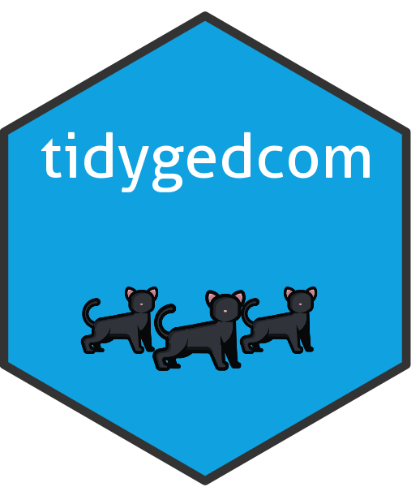

<!-- README.md is generated from README.Rmd. Please edit that file -->

# tidygedcom

<!-- badges: start -->

<a href="https://r-computing-lab.github.io/tidygedcom/"></a>

[](https://www.repostatus.org/#active)
[](https://cran.r-project.org/package=tidygedcom)
[](https://cran.r-project.org/web/checks/check_results_tidygedcom.html)
[](https://cran.r-project.org/package=tidygedcom)</br>
[](https://github.com/R-Computing-Lab/tidygedcom/actions/workflows/R-CMD-check.yaml)
[](https://github.com/R-Computing-Lab/tidygedcom/actions/workflows/R-CMD-dev_maincheck.yaml)
[](https://www.codefactor.io/repository/github/r-computing-lab/tidygedcom)
[](https://app.codecov.io/gh/R-Computing-Lab/tidygedcom)

<!-- badges: end -->

The tidygedcom R package offers a comprehensive suite of functions
tailored for extended behavior genetics analysis, including model
identification, calculating relatedness, pedigree conversion, pedigree
simulation, and more.

## Installation

You can install the released version of tidygedcom from
[CRAN](https://cran.r-project.org/) with:

``` r
install.packages("tidygedcom")
```

To install the development version of tidygedcom from
[GitHub](https://github.com/) use:

``` r
# install.packages("devtools")
devtools::install_github("R-Computing-Lab/tidygedcom")
```

## Citation

If you use tidygedcom in your research or wish to refer to it, please
cite the following paper:

    citation(package = "tidygedcom")

    Warning in citation(package = "tidygedcom"): could not determine year for
    'tidygedcom' from package DESCRIPTION file

Garrison S (????). *tidygedcom: Tidy Gedcom Files*. R package version
0.1.0, <https://github.com/R-Computing-Lab/tidygedcom/>.

A BibTeX entry for LaTeX users is

    Warning in citation(package = "tidygedcom"): could not determine year for
    'tidygedcom' from package DESCRIPTION file
    @Manual{,
      title = {tidygedcom: Tidy Gedcom Files},
      author = {S. Mason Garrison},
      note = {R package version 0.1.0},
      url = {https://github.com/R-Computing-Lab/tidygedcom/},
    }

## Contributing

Contributions to the tidygedcom project are welcome. For guidelines on
how to contribute, please refer to the [Contributing
Guidelines](https://github.com/R-Computing-Lab/tidygedcom/blob/main/CONTRIBUTING.md).
Issues and pull requests should be submitted on the GitHub repository.
For support, please use the GitHub issues page.

### Branching and Versioning System

The development of tidygedcom follows a [GitFlow branching
strategy](https://docs.gitlab.com/user/project/repository/branches/strategies/):

- **Feature Branches**: All major changes and new features should be
  developed on separate branches created from the dev_main branch. Name
  these branches according to the feature or change they are meant to
  address.
- **Development Branches**: Our approach includes two development
  branches, each serving distinct roles:
  - **`dev_main`**: This branch is the final integration stage before
    changes are merged into the `main` branch. It is considered stable,
    and only well-tested features and updates that are ready for the
    next release cycle are merged here.
  - **`dev`**: This branch serves as a less stable, active development
    environment. Feature branches are merged here. Changes here are more
    fluid and this branch is at a higher risk of breaking.
- **Main Branch** (`main`): The main branch mirrors the stable state of
  the project as seen on CRAN. Only fully tested and approved changes
  from the dev_main branch are merged into main to prepare for a new
  release.

## License

tidygedcom is licensed under the GNU General Public License v3.0. For
more details, see the
[LICENSE.md](https://github.com/R-Computing-Lab/tidygedcom/blob/main/LICENSE.md)
file.
