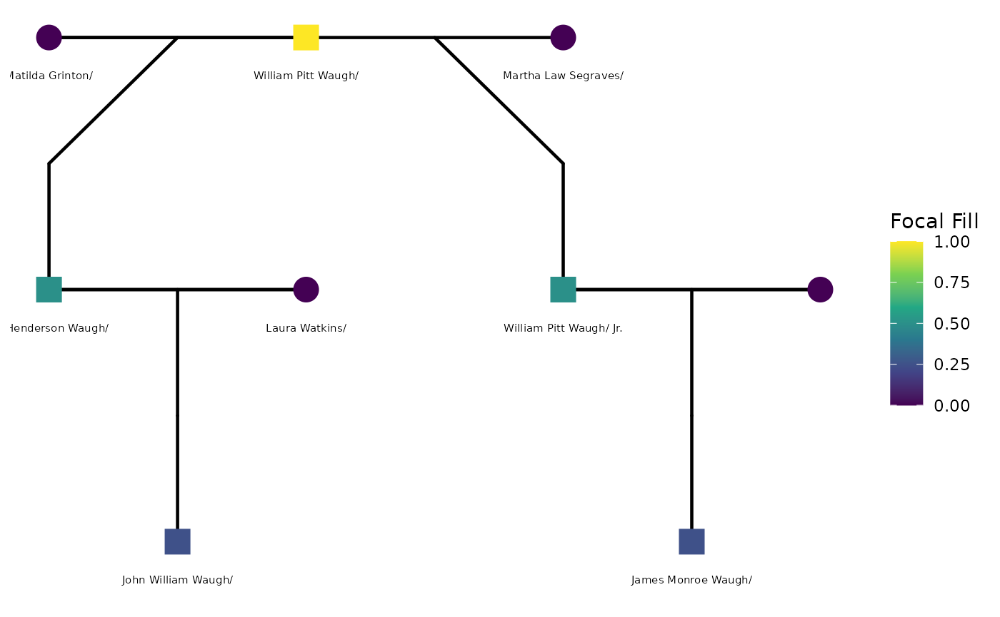

# Getting Started with tidygedcom

## What is a GEDCOM file?

GEDCOM (Genealogical Data Communication) is a plain-text file format
used by virtually every genealogy platform — Ancestry, FamilySearch,
MyHeritage, Gramps, and others. A typical workflow looks like this:

1.  Build or find a family tree on Ancestry.com (or similar).
2.  Export it as a `.ged` file from the tree settings page.
3.  Load it into R with
    [`readGedcom()`](https://r-computing-lab.github.io/tidygedcom/reference/readGedcom.md).

The file itself is a structured text file. Here is a small slice:

``` default
0 @I1@ INDI
1 NAME William Pitt /Waugh/
1 SEX M
1 BIRT
2 DATE 28 APR 1775
2 PLAC Adams County, Pennsylvania, USA
1 DEAT
2 DATE 14 AUG 1852
2 PLAC Wilkes County, North Carolina, USA
1 FAMS @F28@
1 FAMS @F29@

0 @F28@ FAM
1 HUSB @I1@
1 WIFE @I2@
1 CHIL @I3@

0 @F29@ FAM
1 HUSB @I1@
1 WIFE @I4@
1 CHIL @I5@
```

Individual records (`INDI`) hold person-level facts; family records
(`FAM`) link spouses and children and carry marriage or divorce events.

## Why use R for genealogy?

The tidygedcom package provides tools for parsing and tidying GEDCOM
files, making it easier to work with genealogical data in R. R’s
powerful data manipulation capabilities allow researchers to clean,
analyze, and visualize genealogical data in ways that may not be
possible with traditional genealogy software. Additionally, R’s
extensive ecosystem of packages for statistical analysis and machine
learning can be applied to genealogical data to uncover patterns and
insights that may not be immediately apparent.

This vignette uses a real family tree as its running example: the W.
Henderson Waugh Family Tree. We’ll discuss more about our running
example in another vignette. (But briefly, the Waugh family tree is a
genetic genealogy collaboration between two Wake Forest psychology
faculty – SMG and CEW. See
<https://www.arcadiapublishing.com/products/slavery-in-wilkes-county-north-carolina-9781467135832>
for more on the historical context of the Waugh family tree.) The
tidygedcom package provides the tools for parsing and tidying GEDCOM
files, and the Waugh family tree provides a real-world test case for
these tools.

## A minimal example

We construct a small GEDCOM in memory that captures the key
relationships described above. This allows all code examples below to
run without an external file.

``` r

sample_ged <- c(
  "0 HEAD",
  "1 GEDC",
  "2 VERS 5.5.1",
  "1 CHAR UTF-8",

  # William Pitt Waugh Sr. — the common paternal ancestor
  "0 @I1@ INDI",
  "1 NAME William Pitt /Waugh/",
  "1 SEX M",
  "1 BIRT",
  "2 DATE 28 APR 1775",
  "2 PLAC Adams County, Pennsylvania, USA",
  "1 DEAT",
  "2 DATE 14 AUG 1852",
  "2 PLAC Wilkes County, North Carolina, USA",
  "1 FAMS @F1@",
  "1 FAMS @F2@",

  # Matilda Grinton — mother of W. Henderson Waugh
  "0 @I2@ INDI",
  "1 NAME Matilda /Grinton/",
  "1 SEX F",
  "1 BIRT",
  "2 DATE ABT 1797",
  "2 PLAC North Carolina, USA",
  "1 FAMS @F1@",

  # W. Henderson Waugh — 2nd great-grandfather of focal person
  "0 @I3@ INDI",
  "1 NAME W. Henderson /Waugh/",
  "1 SEX M",
  "1 BIRT",
  "2 DATE ABT 1835",
  "2 PLAC Wilkes County, North Carolina, USA",
  "1 FAMC @F1@",
  "1 FAMS @F3@",

  # Martha Law Segraves — mother of William Pitt Waugh Jr.
  "0 @I4@ INDI",
  "1 NAME Martha Law /Segraves/",
  "1 SEX F",
  "1 BIRT",
  "2 DATE OCT 1814",
  "1 FAMS @F2@",

  # William Pitt Waugh Jr. (born William Segraves) — paternal half-brother of W. Henderson
  "0 @I5@ INDI",
  "1 NAME William Pitt /Waugh/ Jr.",
  "1 SEX M",
  "1 BIRT",
  "2 DATE 1844",
  "2 PLAC Wilkes County, North Carolina, USA",
  "1 DEAT",
  "2 DATE FEB 1880",
  "1 FAMC @F2@",
  "1 FAMS @F4@",

  # Laura Watkins — wife of W. Henderson Waugh
  "0 @I6@ INDI",
  "1 NAME Laura /Watkins/",
  "1 SEX F",
  "1 BIRT",
  "2 DATE ABT 1846",
  "2 PLAC North Carolina, USA",
  "1 FAMS @F3@",

  # John William (Bud) Waugh — son of W. Henderson; great-grandfather of focal person
  "0 @I7@ INDI",
  "1 NAME John William /Waugh/",
  "1 SEX M",
  "1 BIRT",
  "2 DATE ABT JUN 1880",
  "2 PLAC North Carolina, USA",
  "1 FAMC @F3@",

  # James Monroe Waugh — son of William Pitt Jr.; Y-DNA candidate branch
  "0 @I8@ INDI",
  "1 NAME James Monroe /Waugh/",
  "1 SEX M",
  "1 BIRT",
  "2 DATE 10 NOV 1867",
  "1 DEAT",
  "2 DATE 23 JUL 1937",
  "1 FAMC @F4@",

  # Family 1: William Pitt Sr. + Matilda Grinton -> W. Henderson Waugh
  "0 @F1@ FAM",
  "1 HUSB @I1@",
  "1 WIFE @I2@",
  "1 CHIL @I3@",

  # Family 2: William Pitt Sr. + Martha Segraves -> William Pitt Jr.
  # _SREL friend marks this as a non-marital relationship in Ancestry exports
  "0 @F2@ FAM",
  "1 HUSB @I1@",
  "1 WIFE @I4@",
  "1 CHIL @I5@",
  "1 _SREL friend",

  # Family 3: W. Henderson Waugh + Laura Watkins
  "0 @F3@ FAM",
  "1 HUSB @I3@",
  "1 WIFE @I6@",
  "1 CHIL @I7@",
  "1 MARR",
  "2 DATE 24 JUN 1877",
  "2 PLAC Wilkes County, North Carolina, USA",

  # Family 4: William Pitt Jr. + wife
  "0 @F4@ FAM",
  "1 HUSB @I5@",
  "1 CHIL @I8@",
  "0 TRLR"
)

tmp_ged <- tempfile(fileext = ".ged")
writeLines(sample_ged, tmp_ged)
```

## Reading individual records: `readGedcom()`

[`readGedcom()`](https://r-computing-lab.github.io/tidygedcom/reference/readGedcom.md)
parses all `INDI` blocks and returns one row per person. It infers
`momID` and `dadID` automatically by tracing `FAMC` → `FAMS` links — no
manual ID mapping required.

``` r

ped <- readGedcom(tmp_ged, verbose = FALSE)
ped[, c("personID", "name", "sex", "birth_date", "death_date", "momID", "dadID")]
#>   personID                    name sex   birth_date  death_date momID dadID
#> 1        1      William Pitt Waugh   M  28 APR 1775 14 AUG 1852  <NA>  <NA>
#> 2        2         Matilda Grinton   F     ABT 1797        <NA>  <NA>  <NA>
#> 3        3      W. Henderson Waugh   M     ABT 1835        <NA>     2     1
#> 4        4     Martha Law Segraves   F     OCT 1814        <NA>  <NA>  <NA>
#> 5        5 William Pitt Waugh/ Jr.   M         1844    FEB 1880     4     1
#> 6        6           Laura Watkins   F     ABT 1846        <NA>  <NA>  <NA>
#> 7        7      John William Waugh   M ABT JUN 1880        <NA>     6     3
#> 8        8      James Monroe Waugh   M  10 NOV 1867 23 JUL 1937  <NA>     5
```

Notice that W. Henderson Waugh and William Pitt Waugh Jr. share the same
`dadID` — William Pitt Waugh Sr. — reflecting the half-sibling
relationship in the parsed data.

### GEDCOM version

``` r

attr(ped, "gedcom_version")
#> [1] "5.5.1"
```

## Quick overview: `summarizeGedcom()`

``` r

summarizeGedcom(ped)
#> GEDCOM Summary  (version: 5.5.1 )
#>   Individuals: 8 
#>   Sex: M = 5 | F = 3 | Unknown = 0 
#>   With birth date: 8  (100%) 
#>   With death date: 3  (38%) 
#>   With birth place: 6  (75%) 
#>   With death place: 1  (12%) 
#>   With known mother: 3  (38%) 
#>   With known father: 4  (50%)
```

For a large real-world file (the full W. Henderson Waugh tree has
several hundred individuals), this is the first thing to call after
loading — it shows at a glance how much birth, death, and parentage data
is present before any cleaning.

## Working with dates

GEDCOM dates are raw strings that often carry qualifiers (`ABT`, `BEF`,
`AFT`) or calendar escape codes (`@#DGREGORIAN@`). Historical genealogy
— especially for antebellum American records — is full of approximate
dates: birth years reconstructed from census age questions, death years
inferred from probate filings, and marriage dates from county clerk
records that were never systematically kept.

### Parse to `Date` objects

Pass `parse_dates = TRUE` to convert `birth_date` and `death_date` to
proper `Date` objects. Qualifiers and escapes are stripped first:

``` r

ped_dates <- readGedcom(tmp_ged, parse_dates = TRUE, verbose = FALSE)
ped_dates[, c("name", "birth_date", "death_date")]
#>                      name birth_date death_date
#> 1      William Pitt Waugh 1775-04-28 1852-08-14
#> 2         Matilda Grinton       <NA>       <NA>
#> 3      W. Henderson Waugh       <NA>       <NA>
#> 4     Martha Law Segraves       <NA>       <NA>
#> 5 William Pitt Waugh/ Jr.       <NA>       <NA>
#> 6           Laura Watkins       <NA>       <NA>
#> 7      John William Waugh       <NA>       <NA>
#> 8      James Monroe Waugh 1867-11-10 1937-07-23
```

### Extract a year from any GEDCOM date string

Not all dates parse cleanly to `Date` objects — `"ABT 1835"` or
`"OCT 1814"` have no day component.
[`extractGedcomYear()`](https://r-computing-lab.github.io/tidygedcom/reference/extractGedcomYear.md)
handles all forms and returns an integer year:

``` r

dates_raw <- c(
  "28 APR 1775", "14 AUG 1852", "ABT 1835", "OCT 1814",
  "1844", "ABT JUN 1880", NA
)
extractGedcomYear(dates_raw)
#> [1] 1775 1852 1835 1814 1844 1880   NA
```

A typical use: add a `birth_year` column robust to approximate dates,
then flag individuals who may still be living:

``` r

ped$birth_year <- extractGedcomYear(ped$birth_date)
ped$death_year <- extractGedcomYear(ped$death_date)
ped[, c("name", "birth_year", "death_year")]
#>                      name birth_year death_year
#> 1      William Pitt Waugh       1775       1852
#> 2         Matilda Grinton       1797         NA
#> 3      W. Henderson Waugh       1835         NA
#> 4     Martha Law Segraves       1814         NA
#> 5 William Pitt Waugh/ Jr.       1844       1880
#> 6           Laura Watkins       1846         NA
#> 7      John William Waugh       1880         NA
#> 8      James Monroe Waugh       1867       1937
```

## Reading family records: `readGedcomFamilies()`

Marriage and relationship data live in `FAM` blocks.
[`readGedcomFamilies()`](https://r-computing-lab.github.io/tidygedcom/reference/readGedcomFamilies.md)
parses them into a separate data frame:

``` r

fam <- readGedcomFamilies(tmp_ged, verbose = FALSE)
fam[, c("famID", "husbID", "wifeID", "marr_date", "marr_place")]
#>   famID husbID wifeID   marr_date                         marr_place
#> 1     1      1      2        <NA>                               <NA>
#> 2     2      1      4        <NA>                               <NA>
#> 3     3      3      6 24 JUN 1877 Wilkes County, North Carolina, USA
#> 4     4      5   <NA>        <NA>                               <NA>
```

The `_SREL friend` tag on Family 2 — the non-marital relationship
between William Pitt Waugh Sr. and Martha Law Segraves — is preserved in
the raw GEDCOM but not yet parsed as a structured column. This is a
known limitation when working with Ancestry.com exports that use
non-standard tags.

Join back to the individuals table to annotate both families with spouse
names:

``` r

merge(
  fam[, c("famID", "husbID", "wifeID", "marr_date", "marr_place")],
  ped[, c("personID", "name")],
  by.x = "husbID", by.y = "personID", all.x = TRUE
) |>
  merge(
    ped[, c("personID", "name")],
    by.x = "wifeID", by.y = "personID", all.x = TRUE,
    suffixes = c("_husb", "_wife")
  )
#>   wifeID husbID famID   marr_date                         marr_place
#> 1      2      1     1        <NA>                               <NA>
#> 2      4      1     2        <NA>                               <NA>
#> 3      6      3     3 24 JUN 1877 Wilkes County, North Carolina, USA
#> 4   <NA>      5     4        <NA>                               <NA>
#>                 name_husb           name_wife
#> 1      William Pitt Waugh     Matilda Grinton
#> 2      William Pitt Waugh Martha Law Segraves
#> 3      W. Henderson Waugh       Laura Watkins
#> 4 William Pitt Waugh/ Jr.                <NA>
```

## Working with coordinates

GEDCOM stores coordinates in compass-prefix notation (`N36.1234`,
`W81.5678`).
[`convertGedcomCoords()`](https://r-computing-lab.github.io/tidygedcom/reference/convertGedcomCoords.md)
converts all `_lat`/`_long` columns to signed decimal degrees in one
call:

``` r

coord_ged <- c(
  "0 HEAD", "1 GEDC", "2 VERS 5.5.1", "1 CHAR UTF-8",
  "0 @I1@ INDI",
  "1 NAME William Pitt /Waugh/",
  "1 SEX M",
  "1 BURI",
  "2 PLAC Smithey Cemetery, Wilkes County, NC",
  "2 MAP",
  "3 LATI N36.1548",
  "3 LONG W81.1845",
  "0 TRLR"
)
tmp_coord <- tempfile(fileext = ".ged")
writeLines(coord_ged, tmp_coord)

ped_raw <- readGedcom(tmp_coord, remove_empty_cols = FALSE, verbose = FALSE)
ped_conv <- convertGedcomCoords(ped_raw)
ped_raw[, c("name", "burial_lat", "burial_long")]
#>                 name burial_lat burial_long
#> 1 William Pitt Waugh   N36.1548    W81.1845
ped_conv[, c("name", "burial_lat", "burial_long")]
#>                 name burial_lat burial_long
#> 1 William Pitt Waugh    36.1548    -81.1845
unlink(tmp_coord)
```

You can also call the underlying converters directly:

``` r

gedcomLat2Numeric(c("N36.1548", "S33.8688", NA))
#> [1]  36.1548 -33.8688       NA
gedcomLon2Numeric(c("W81.1845", "E151.2093", NA))
#> [1] -81.1845 151.2093       NA
```

## From GEDCOM to pedigree analysis

Once the data is in a tidy data frame, the `BGmisc` package provides the
next layer of analysis: computing pairwise relatedness, tracing paternal
lineages, and identifying Y-chromosome carriers.

``` r

library(BGmisc)
#> 
#> Attaching package: 'BGmisc'
#> The following objects are masked from 'package:tidygedcom':
#> 
#>     buildTreeGrid, getWikiTreeSummary, readGed, readgedcom, readGedcom,
#>     readWikifamilytree, royal92, traceTreePaths

ped <- readGedcom(tmp_ged, verbose = FALSE)

# Check the pedigree is acyclic and well-formed
checks <- checkPedigreeNetwork(ped,
  personID = "personID", momID = "momID", dadID = "dadID",
  verbose = FALSE
)
checks$is_acyclic
#> [1] TRUE
```

Please see the vignette “From GEDCOM to pedigree analysis” for a longer
walkthrough of these steps using the W. Henderson Waugh family tree as a
case study.

## From GEDCOM to pedigree diagrams

You can also visualize the family tree with the `ggpedigree` package.
The `config` argument allows you to customize the plot with a wide range
of options.

``` r

library(BGmisc)
library(ggpedigree)
ped <- readGedcom(tmp_ged, verbose = FALSE)

ggpedigree(
  ped,
  personID = "personID",
  momID = "momID",
  dadID = "dadID",
  sexVar = "sex",
  config = list(
    label_include = TRUE,
    code_male = "M",
    code_female = "F",
    label_column = "name",
    label_text_size = 2,
    focal_fill_include = TRUE,
    sex_color_include = F,
    focal_fill_personID = 1,
    focal_fill_method = "viridis_c",
    segment_lineage_include = TRUE,
    segment_lineage_focal_personID = 1,
    segment_lineage_component = "paternal",
    segment_lineage_legend_title = "Patriline",
    add_phantoms = TRUE
  )
)
#> REPAIR IN EARLY ALPHA
```



``` r


## Cleaning up
```

Please see the vignettes from the `ggpedigree` package for more on
customizing pedigree diagrams with
[`ggpedigree()`](https://r-computing-lab.github.io/ggpedigree/reference/ggPedigree.html).

``` r

unlink(tmp_ged)
```

## Summary of functions

Function \| Purpose \|

\|\|\| \| `readGedcom(file)` \| Parse `INDI` blocks → one row per person
\| \| `readGedcomFamilies(file)` \| Parse `FAM` blocks → one row per
family \| \| `summarizeGedcom(df)` \| Coverage counts and percentages \|
\| `extractGedcomYear(x)` \| Year from any GEDCOM date string \| \|
`convertGedcomCoords(df)` \| Convert `_lat`/`_long` columns to decimal
degrees \| \| `gedcomLat2Numeric(x)` \| Convert a latitude string vector
\| \| `gedcomLon2Numeric(x)` \| Convert a longitude string vector \|
